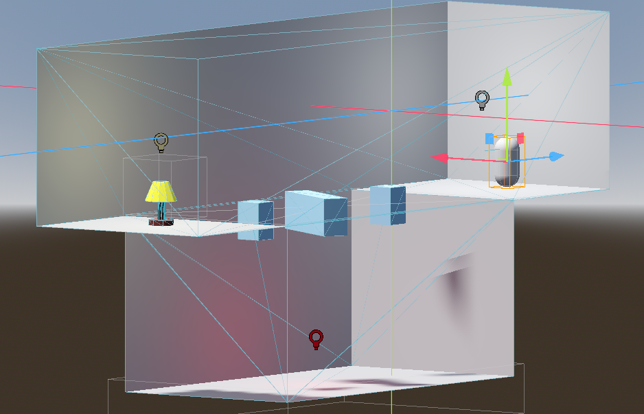

# Tutorial 7 - Basic 3D Game Mechanics & Level Design

## Proses Pengerjaan: Latihan Tutorial

Kurang lebih mengikuti tutorial, dengan melakukan beberapa *tweaks* seperti:
mengubah FOV `Camera3D` menjadi 90 derajat, membuat level dengan layout yang berbeda,
serta desain lampu yang tidak 1:1 dengan tutorial.

## Proses Pengerjaan: Eksplorasi Mechanics 3D

Pertama, saya mengerjakan mekanik Pick up & Inventory system.
Item yang bisa diambil oleh Player adalah **Coin** yang disimpan ke *inventory* dan ditampilkan di HUD.

Kemudian, saya mengerjakan mekanik Sprinting & Crouching.
Sprinting (`LeftShift`) akan menaikkan FOV kamera menjadi 95 derajat, dan `speed` menjadi 10 (dari 8).
Crouching (`LeftCtrl`) akan memberikan offset vertikal `-0.25` dan `speed` menjadi 1.
Apabila Player tidak menekan kedua key tersebut, maka akan dianggap "berjalan" dengan FOV kamera 90 derajat, offset vertikal 0, dan `speed=8`

## Proses Pengerjaan: Polishing

Untuk polishing, saya melakukan:

- Menambahkan Level 2 yang dapat diakses dari menyelesaikan Level 1
  - Menyelesaikan Level 2 akan menampilkan Win Screen
- Menambahkan coin counter HUD
- Mengubah scene utama menjadi Level 1
- Menambahkan sumber cahaya tambahan ke Level 1 dan Level 2
- Menambahkan sumber cahaya ke scene ObjLamp
- Menambahkan sumber cahaya ke scene Coin
- Menambahkan animasi berputar dan naik-turun di scene Coin

## Referensi

- [Godot's Ease Function](https://byteatatime.dev/posts/easings/)
- [Animating the relative position in AnimationPlayer](https://www.reddit.com/r/godot/comments/qsqctn/comment/hkfdjlh/)
